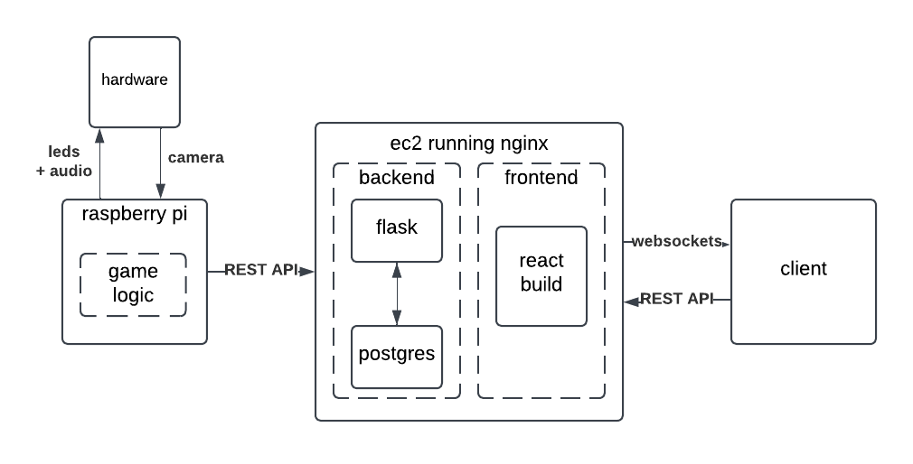

# fruit-ninja

A physical implementation of Fruit Ninja using IoT hardware. The game is rendered on LED strips and played using computer vision. A run's statistics are viewable on a website.

## Hardware
- Raspberry Pi 4
- Pixy2 Camera
- WS2812B LED Strips
- Speakers

## Infrastructure
The game logic is implemented directly on the Raspberry Pi. Game events are sent to a Flask server hosted on AWS, which are logged in Postgres and forwarded to a React frontend via Websockets.

